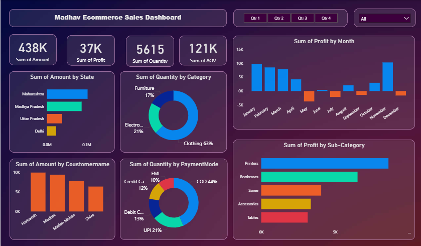

# 🛍️ Madhav Ecommerce Sales Dashboard – Power BI Project

This project showcases a professional sales dashboard built in Power BI using ecommerce sales data. The dashboard visualizes regional performance, product-wise profitability, payment modes, and customer behavior.

---

## 🎯 Project Objective

- Analyze and visualize sales performance using interactive Power BI reports.
- Identify top-performing states, product categories, and customer segments.
- Discover monthly profit trends and seasonal patterns.
- Provide a quick view of sales KPIs like Total Amount, Profit, Quantity, and AOV (Average Order Value).
- Enable interactive filtering by quarter and category.

---

## 📊 Dataset Description

The project uses two datasets:

1. **`orders.csv`** – Includes customer details like name, city, state, and order date information.

2. **`details.csv`** – Contains transactional sales data such as amount, profit, quantity sold, product category, sub-category, payment mode, and order IDs.

---

## 🛠️ Tools & Technologies

- **Power BI Desktop**
- **Power Query Editor** – for data cleaning and shaping
- **DAX (Data Analysis Expressions)** – for calculated KPIs
- **Power BI Visuals** – bar charts, donut charts, cards, map visuals

---

## 🧮 Key DAX Measures

- `Total Sales = SUMX(Orders, Orders[Quantity] * Orders[Unit Price])`
- `Total Profit`
- `AOV = DIVIDE([Total Sales], DISTINCTCOUNT(Orders[Order ID]))`
- `MTD Sales`, `YTD Sales`, `Previous Month Profit`

---

## 📈 Dashboard Features

- 🔹 KPI Cards: Total Sales, Profit, Quantity, AOV
- 🔹 Donut Charts: Quantity by Category, Payment Mode
- 🔹 Bar Charts: Amount by Customer, Profit by Sub-Category
- 🔹 Map Visual: Amount by State
- 🔹 Line Chart: Monthly Profit Trend
- 🔹 Slicers: Quarterly and Category filters

---

## 💡 Key Insights

- 🏆 **Clothing** dominates sales with 63% of quantity.
- 📍 **Maharashtra** is the highest-grossing state.
- 💳 **Cash on Delivery (44%)** is the most used payment mode.
- 📉 Losses were recorded in June and July.
- 📈 October saw the highest monthly profit.
- 📚 **Printers** and **Bookcases** are the most profitable sub-categories.

---

## 🖼️ Dashboard Preview

